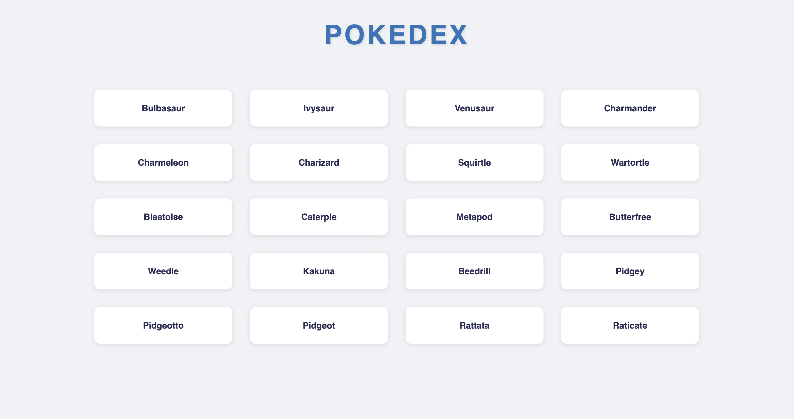

# Pokemon List - 15 Minutes Challenge

## Setup Project

1. Clone repository ini

```bash
git clone <repository-url>
```

2. Masuk ke folder project

```bash
cd pokemon-list-challenge
```

3. Install dependencies

```bash
npm install
```

4. Jalankan project

```bash
npm run dev
```

## Tugas

Tampilkan daftar nama Pokemon menggunakan PokeAPI.

### Waktu

15 menit

### Yang Perlu Dilakukan

1. Ambil data Pokemon dari API
2. Tampilkan nama-nama Pokemon dalam bentuk card

### Hasil Akhir yang Diharapkan



### Langkah-langkah

1. Buka file `src/components/PokemonList.jsx`
2. Tambahkan state untuk menyimpan list pokemon
3. Gunakan axios untuk mengambil data dari:
   `https://pokeapi.co/api/v2/pokemon?limit=20`

### Contoh Data dari API

```javascript
// Data yang kamu dapat dari API:
{
  "results": [
    {
      "name": "bulbasaur"
    },
    {
      "name": "ivysaur"
    }
  ]
}

// Yang perlu kamu tampilkan:
<PokemonCard name="bulbasaur" />
<PokemonCard name="ivysaur" />
```

### Tips Singkat

- Gunakan useState untuk menyimpan data pokemon
- Gunakan useEffect dan axios untuk fetch data
- Gunakan .map untuk menampilkan semua pokemon
- Gunakan PokemonCard yang sudah disediakan

### Penilaian

- Berhasil mengambil data dari API (50%)
- Berhasil menampilkan nama pokemon dalam card (50%)
